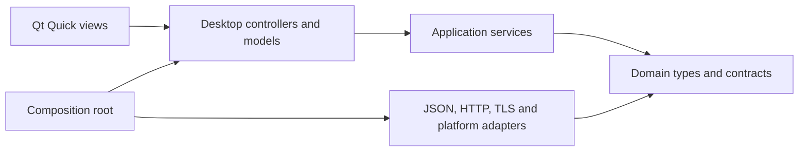

# C++ architecture

The `future` branch migrates the complete KiroX application to C++20 and Qt Quick.
Migration is complete only when the native implementation covers the existing
registration workflow, all mailbox providers, task scheduling, persistence,
proxy management, updates, notifications, localization and release packaging.

## Dependency direction

`kirox_domain` uses Qt Core value types, with no QObject, GUI or network
dependencies. It owns provider identity, account parsing, proxy validation,
settings validation, errors and cancellation contracts.

`kirox_application` coordinates use cases through the repository, transport,
mailbox and registration interfaces. Serialization belongs to the repository;
services do not instantiate HTTP clients or depend on desktop widgets. New mailbox and transport adapters
are registered in the composition root rather than added to UI conditionals.

`kirox_infrastructure` implements those interfaces. A transport session belongs
to one worker thread and one account, preserving isolated cookie state. Network
operations carry a stop token and deadline. An operation never disables TLS
certificate verification implicitly.

`src/desktop` connects services to Qt models and signals. QML owns layout and
interaction; business logic and persistence remain in C++. Workers return
results through queued signals. Widgets are used only for native file dialogs.

## Storage and compatibility

The existing `settings.json` schema and account/provider configuration files
remain readable. Unknown extension fields survive mutations. Missing provider
identifiers on legacy accounts mean Outlook; provider plus email is the account
identity, so a mixed pool cannot remove or register another provider's mailbox.

The repository serializes each complete read/mutate/atomic-write transaction.
`QSaveFile` commits files without exposing partial JSON. Invalid existing data
is reported and retained. Directory changes copy every business document before
committing the settings pointer; failed migrations remove only files they
created. Previous directories remain available for rollback.

`KIROX_DATA_HOME` or `--data-home` selects an isolated installation. Tests always
use temporary roots and local network fixtures. Tests never send live signup
requests or read user mailbox credentials.

## UI material rules

The native UI follows Apple's [Materials guidance](https://developer.apple.com/design/human-interface-guidelines/materials)
and [Liquid Glass overview](https://developer.apple.com/documentation/technologyoverviews/liquid-glass).
Navigation and toolbars float over the background using blurred sampling,
rounded masks, restrained tint and rim highlights. Content uses opaque standard
surfaces to preserve hierarchy and readable text. Controls provide focus,
hover and pressed states. Reduced motion and reduced transparency settings
disable optional visual effects. The design is an interpretation implemented
with Qt Quick, without claiming use of Apple's SwiftUI material APIs.

## Verification and rollout

Use CMake presets for reproducible Debug and Release builds and CTest for
isolated tests. Check the real rendered UI using `--screenshot` and `--page`.
The superseded Go/Wails and web frontend sources have been removed. Native
builds and installed packages are verified by the three-platform CI workflow.
See the migration checklist for evidence and the development guide for protocol
differences and manual verification limits.
